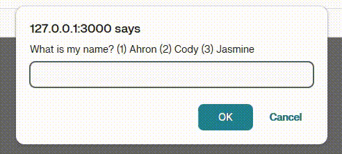
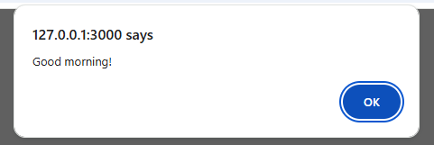
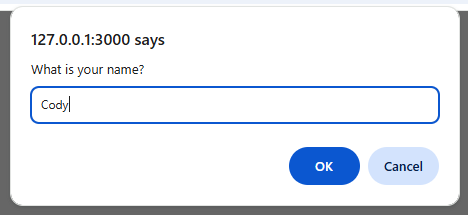
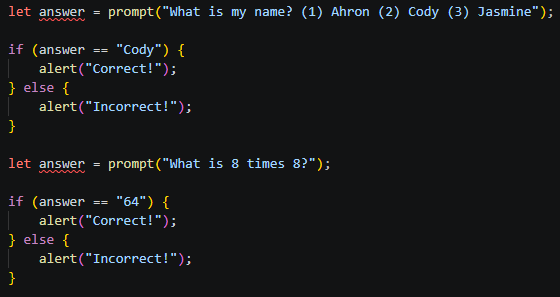

# About Me Quiz
Use basic javascript to create a quiz of anything you like!




## The Task
No HTML or CSS today! We are only working using JavaScript. Here's everything you need to know about JavaScript to make the quiz:

```
alert("Good morning!");
```

In order to talk to your user using JavaScript, use the `alert` function. __To see the message, make sure you open your website in a new tab!__



In order to ask your user for something, use the `prompt` function:

```
let answer = prompt("What is your name?");
```



This line of code makes our browser ask a question! It will store the answer into a variable named `answer`. We can name the variable whatever we want:

```
let age = prompt("How old are you?");
```

It does not have to be `answer` every time!

## Making the Quiz

What makes a quiz a quiz is that there are right answers and wrong answers! Our website needs to ask a question, then figure out if the answer was right or wrong. This can be done with an `if` statement:

```
let answer = prompt("What is 1 + 1?");

if (answer == "2") {
    alert("Correct!");
} else {
    alert("Incorrect!");
}
```

Any input that isn't "2" will be considered incorrect!

✅ Your turn! Create five questions! They can be simple math quizzes, facts about sports, or a question about yourself!

❗ You might get red squiggly lines if you use the same variable name to store the answer:



To fix this, either:
1. Take out the `let` from the second `let answer =..`, because `let` creates a new variable but you don't need a new one every time if you change the answer.

or

2. Change the variable name to something new, like `let name =...` and `let number =...` so you make a new variable every time.


## Improving the Quiz

What's the point of a quiz if you don't get a score? Let's give our user points when they get questions right, and tell them their score at the end!

### Adding score

We first need to create a variable to keep track of score.

```
let score = 0;
```

Put this in the beginning of your code.

For every `alert("Correct!");` in your code, you want to increase the score:

```
if (answer == "64") {
    alert("Correct!");
    score = score + 1
} else {
    alert("Incorrect! It was 64!");
}
```

Feel free to make wrong answers take away points if you're evil.

To tell your user how many points they got at the end, let's create a message to tell them, then alert it!

```
message = "You got " + score + " out of five points!"
alert(message)
```

✅ Your turn! Add a scoring system to your quiz! You can make it out of 5 points, out of 100, or even go into the negatives.

### Allowing multiple correct answers

Take a look at this code:

```
answer = prompt("What is my favorite sport? (1) Soccer (2) Basketball (3) Baseball");

if (answer == "Baseball") {
    alert("Correct!");
} else {
    alert("Incorrect! It was Baseball!");
}
```

The answer is "Baseball". What if the user typed in "baseball" or "3"? Those are still correct answers, but our website would say they are wrong. We need to program in multiple answers to our questions.

We can do this using the __or__ operator, which looks like `||`. You type it by holding shift and pressing the slash key underneath your backspace key. `||` means __or__. Take a look at this:

```
answer = prompt("What is my favorite sport? (1) Soccer (2) Basketball (3) Baseball");

if (answer == "Baseball" || answer == "baseball" || answer == "3") {
    alert("Correct!");
} else {
    alert("Incorrect! It was Baseball!");
}
```

This reads as "If the answer is "Baseball" __OR__ if the answer is "baseball" __OR__ if the answer is "3", say the answer is correct. This way, we don't scam our user by telling them they are wrong even if they are right!

✅ Your turn! Make sure at least one of your questions has multiple answers, and __TEST IT__ 😠!

Once you're done, feel free to have a mentor try your quiz!